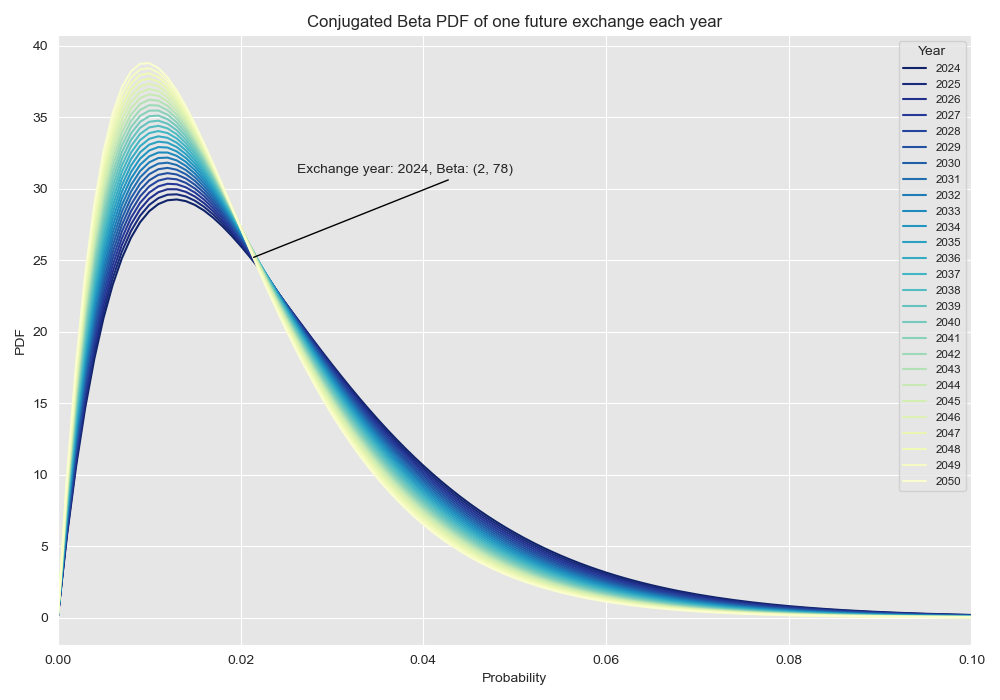
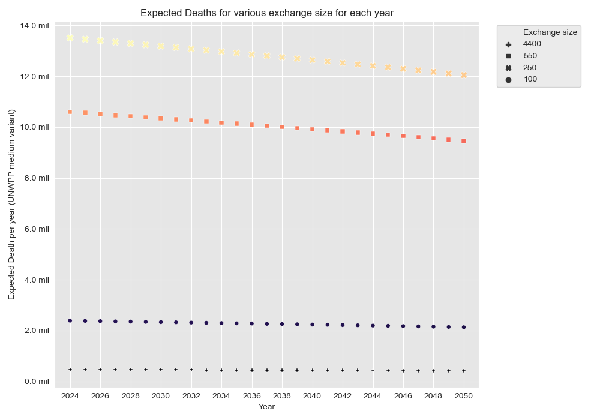
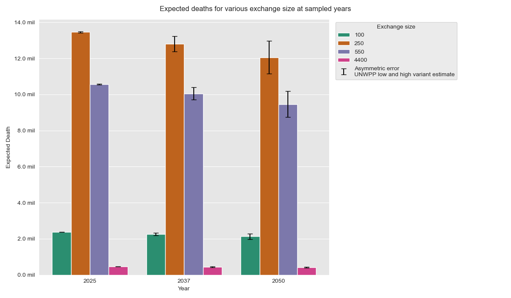

# Modelling the probabilities and expected famine outcomes of nuclear exchanges

## Overview

This project and associated [notebook](./notebooks/P_LargeNuclearWar.ipynb) provides an analysis of the probability and potential impact of a large nuclear war by 2050. The analysis is based on various statistical models and data sources, including nuclear weapon stockpiles, historical detonation data, and population projections.

**Analysis are completed for the review paper [Resilience Reconsidered: The need for modelling resilience in food distribution and trade relations in post-nuclear war recovery](https://www.researchgate.net/publication/378825936_Resilience_Reconsidered_The_need_for_modelling_resilience_in_food_distribution_and_trade_relations_in_post-nuclear_war_recovery)**

### Key Components

1. Probability Density Function (PDF) Analysis:
Utilizes a beta distribution to model the probability of nuclear detonations before 2050.
Considers different scenarios, including no detonations, one detonation, and two detonations in the future.

2. Data Sources:
Nuclear weapon stockpile data from Metaculus and other sources.
Population projections from the United Nations World Population Prospects (UN WPP) 2024.

3. Statistical Modeling:
Uses linear interpolation and beta distribution to estimate the number of nuclear weapons and the probability of detonations.
Employs cubic spline interpolation and least squares optimization for parameter estimation.

4. Impact Assessment:
Calculates expected deaths from nuclear detonations using data from Xia et al. (2022).
Considers different detonation sizes and their impact on global population using growth projections from UN WPP 2024.

5. Visualization:
Provides various plots to visualize the probability distributions and expected impacts of nuclear detonations.
Includes line plots, scatter plots, and bar plots to illustrate the findings.

6. Output:
Generates CSV files with expected deaths under different scenarios and population projections.

## How to install dependencies

Declare any dependencies in environment.yml and uv.lock for cond or uv installation.

To install dependencies, run:

```
conda env create -f environment.yaml
```

or

```
uv sync --frozen
```

## Results

### Beta Distribution for hypothetical nuclear detonations


\
Supplementary S1: Fig 1. Evolution of the Probability Density Function (PDF) of a nuclear war over time. If no detonation occurs, the PDF continues to steepen the negative skew shape (A). In contrast, should a detonation occur at any given year, the PDF shifts significantly positive skew, resulting  in a significant shift in the averages. Tables 3, 4 elucidate the hypothetical scenarios of two future exchanges in 2029 and 2039, where the median beta probability of the subsequent years would inherit the post-exchange probabilities. While at exchange year, probability should equal 1, pure event Beta probability was preserved for observance (B). Analysis of the probabilities of an escalation enables us to estimate the potential exposure, for which we aim to build adaptive capacity.


\
Supplementary S2: Fig 2. The Probability Density Function for a detonation happening each year from 2024 to 2050.

### Expected deaths from nuclear detonations
\
Supplementary S2: Fig 3. Expected deaths for 250 and 550 detonations are the highest because of the combination of likelihood and severity, while exchange size of 4400 (150 Tg) is highly unlikely. The expected deaths calculation suggest it is most important to focus on mitigating between 250 to 550 detonations from a near-term perspective, though a long term perspective would likely make larger exchanges relatively more important.

\
Fig. 2 Expected deaths calculated for various detonation sizes if nuclear war happens in the year 2025, 2037, and 2050 non cumulatively, predicted expected deaths combine direct fatalities and fatalities from starvation at the end of year 2 (Xia et al., 2022: Table 1). An exchange of 4400 (150 Tg) is highly unlikely (Supplementary S2), and therefore the expected deaths are comparatively low. This expected deaths calculation suggests it is most important to focus on mitigation measures for 250 to 550 detonations in the near-term. The gradual decrease in expected deaths across all scenarios through the years can be attributed to reduction in annual probabilities of nuclear war . Population increases were taken into account using UN World Population Prospects estimate variants (UN DESA., 2024) (see Supplementary S2: Fig. 2, 3; Table 5, 6.).
